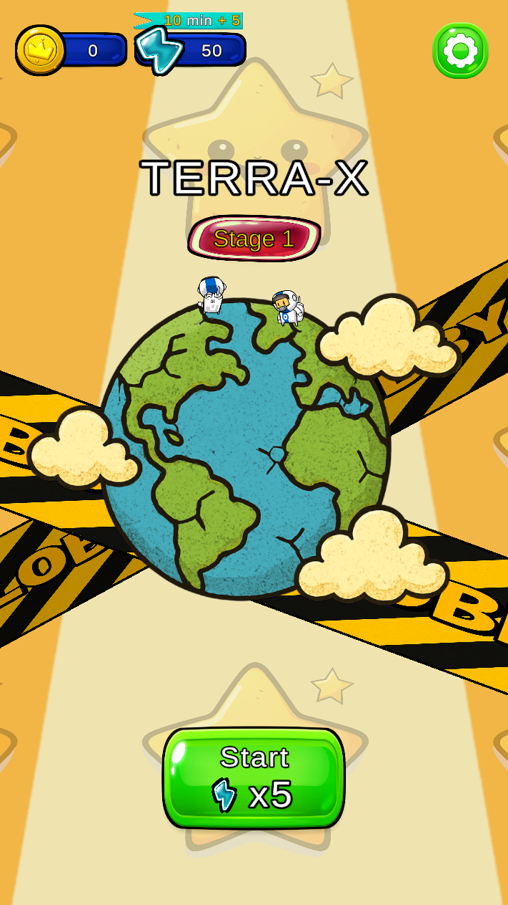
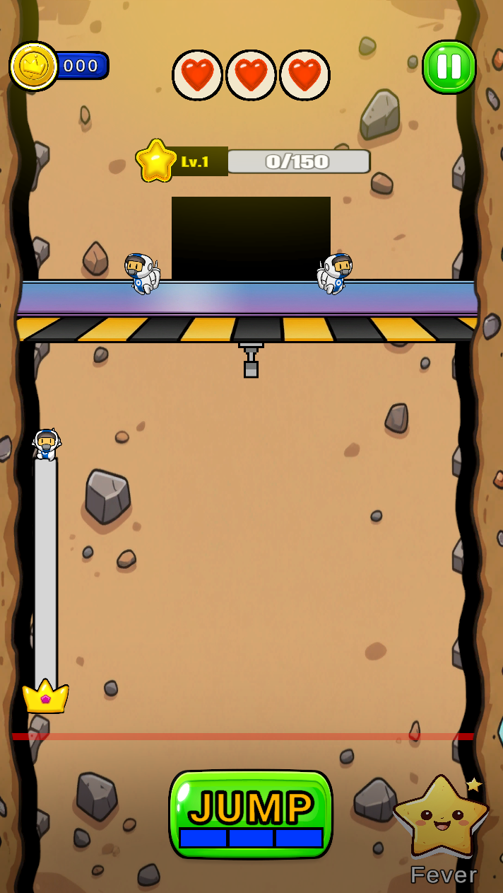

**ProjectB (드드드드릴 모작 게임)**
---

● OS : Mobile<br>
● Unity Version : 2022.3.60f1<br>
● 작업기간 9월 4일 ~ 9월 14일<br>

---
추가<br>
● 9월 22일 Fever Mode


목차
---
1. 게임 소개

2. 조작 방법

3. 주요 기능 / 시스템

4. 스크린샷 / 영상

5. 설치 및 실행

6. 디렉토리 구조

7. 주의 사항

8. 기여 방법

9. 참고 링크


1️⃣ 게임 소개
---
● ProjectB는 땅을 파 내려가며 자원을 수집하고 장비를 강화하는 모바일 캐주얼 게임입니다.

● 랜덤 카드 스폰 기반 로그라이크 요소를 더해, 매번 달라지는 선택과 전략으로 반복 플레이의 재미를 제공합니다.

2️⃣ 조작 방법
---
● Jump 버튼 클릭

3️⃣ 주요 기능 / 시스템
---
**맵 & 게임 모드**

● 씬 : 로비 / 플레이

● 공격 : 자동

● 회피 : Jump 버튼

● 카드 스폰<br>
**Gun**<br>
- Gun Plus / Gun Power Down<br>
- Gun Power Up<br>

**Drone**<br>
- Drone Plus<br>

**Miner**<br>
- Miner Speed Up<br>
- Miner Production Up<br>

**UI / HUD**<br>
---

**Lobby**<br> 
- Coin<br>
- Stamena<br>
- Setting<br>
- StartButton<br>

**Play**<br>
- Coin<br>
- Hp<br>
- Pause<br>
- Exp<br>
- Gauge<br>
- JumpButton<br>
- FeverButton<br>


4️⃣ 스크린샷 / 영상
---




5️⃣ 설치 및 실행
---
● GitHub에서 프로젝트 클론 또는 ZIP 다운로드:

git clone https://github.com/Kimhyogyeom/ProjectB.git


6️⃣ 디렉토리 구조
---
```
Assets/
+---Animations
|   +---Boom
|   +---Card
|   +---Drone
|   +---Fever
|   +---Finish
|   +---Hit
|   +---Hp
|   +---Level
|   +---Lobby
|   +---MIner
|   \---Slice
+---Belevich
|   \---Hyper casual mobile GUI
|       \---Sprites
+---COPY SPRIGHT
|   \---2D Character - Astronaut
|       +---Animations
|       +---Demo
|       +---Prefabs
|       +---Sprites
|       \---Tilemap
+---Images
+---Material
+---Prefabs
|   +---Card
|   +---Game
|   \---Lobby
+---Scenes
+---Scripts
|   +---InGame
|   |   +---Background
|   |   +---BreakGround
|   |   +---Camera
|   |   +---Canvas
|   |   +---Card
|   |   |   \---Deck
|   |   +---Coin
|   |   +---Drone
|   |   +---Enemy
|   |   +---Fever
|   |   +---Finish
|   |   +---GameOver
|   |   +---Ground
|   |   +---Guage
|   |   +---Gun
|   |   +---Level
|   |   +---Manager
|   |   +---Miner
|   |   +---Pause
|   |   \---Text
|   \---Lobby
|       +---Background
|       +---Coin
|       +---Manager
|       +---Setting
|       +---Sound
|       +---Staminar
|       \---Start
+---Settings
|   \---Scenes
+---Sounds
|   +---Lobby
|   +---Play
|   \---UI
+---Sprite
|   \---Lobby
\---TextMesh Pro
    +---Documentation
    +---Examples & Extras
    |   +---Fonts
    |   +---Materials
    |   +---Prefabs
    |   +---Resources
    |   |   +---Color Gradient Presets
    |   |   +---Fonts & Materials
    |   |   \---Sprite Assets
    |   +---Scenes
    |   +---Scripts
    |   +---Sprites
    |   \---Textures
    +---Fonts
    +---Resources
    |   +---Fonts & Materials
    |   +---Sprite Assets
    |   \---Style Sheets
    +---Shaders
    \---Sprites
```


7️⃣ 주의 사항
---

● 빌드 전 Unity 버전 확인 필수


8️⃣ 기여 방법
---
● 기능 추가, 버그 수정, UI 개선 PR 가능

● 코드 스타일: 언더스코어 프리픽스 규칙 준수


9️⃣ 참고 링크
---
● Unity 공식 사이트 (https://unity.com/kr?utm_source=chatgpt.com
)

● Git LFS 안내 (https://git-lfs.com/?utm_source=chatgpt.com
)

---